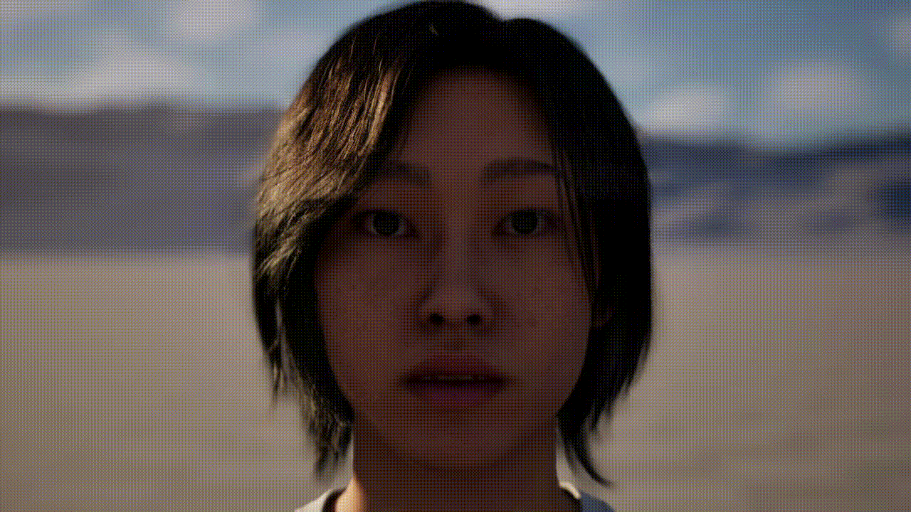

# Avatar Animation

- [Avatar Animation](#avatar-animation)
  - [File Management](#file-management)
  - [Pipeline Overview v2](#pipeline-overview-v2)
    - [26/08/11: Testing showed the need to implement a native BVH reader to update the MetaHuman from the Animation Data sent](#260811-testing-showed-the-need-to-implement-a-native-bvh-reader-to-update-the-metahuman-from-the-animation-data-sent)
      - [Motion Capture Pipeline: LiveLink-Native Architecture (replaces Dummy + IK Retargeter)](#motion-capture-pipeline-livelink-native-architecture-replaces-dummy--ik-retargeter)
        - [Components](#components)
        - [Known trade-off (accepted)](#known-trade-off-accepted)
        - [Next step](#next-step)
  - [Pipeline Overview v1](#pipeline-overview-v1)
  - [Animating an Avatar](#animating-an-avatar)
    - [LiveLink](#livelink)
    - [Pre-Built Animations](#pre-built-animations)
    - [Proceudrally Generating Animations](#proceudrally-generating-animations)
      - [MetaHuman Animator: Audio to Animation](#metahuman-animator-audio-to-animation)
      - [NVIDIA Audio2Face](#nvidia-audio2face)
        - [Important: UE 5.6 Downgrade](#important-ue-56-downgrade)
        - [Installed Plugins](#installed-plugins)
        - [Setup](#setup)
          - [Face AnimBP (NewAnimInstanceFace)](#face-animbp-newaniminstanceface)
        - [Editor Settings](#editor-settings)
        - [Level Blueprint](#level-blueprint)
        - [Current Limitations](#current-limitations)
        - [TODO: Real-Time Streaming Audio](#todo-real-time-streaming-audio)
      - [NVIDIA Kimodo - Full-Rig Diffusion Model](#nvidia-kimodo---full-rig-diffusion-model)
        - [First Test with Kimodo -\> Blender for conversion into FBX animation -\> Retargetting in Unreal Engine to MetaHuman](#first-test-with-kimodo---blender-for-conversion-into-fbx-animation---retargetting-in-unreal-engine-to-metahuman)
        - [Further Kimodo Pipeline Tests](#further-kimodo-pipeline-tests)
          - [Pipeline Time Measurements](#pipeline-time-measurements)
          - [Prompt Engineering](#prompt-engineering)
      - [NVIDIA ARDY (newest state of the art - 26/08/11)](#nvidia-ardy-newest-state-of-the-art---260811)
      - [NVIDIA ACE (Avatar Cloud Engine)](#nvidia-ace-avatar-cloud-engine)
      - [State of the Art: DiDiffGes (2025)](#state-of-the-art-didiffges-2025)
      - [State of the Art: AsynFusion (2025)](#state-of-the-art-asynfusion-2025)

## File Management

**Authors:** Malte Hillebrand

File Change History:

| Date       | Change                     | Author |
| ---------- | -------------------------- | ------ |
| 2026-08-11 | Updated plan after Testing | Malte  |
| 2026-06-15 | Added Audio2Face Section   | Malte  |
| 2026-06-11 | First Version              | Malte  |


## Pipeline Overview v2
 
```
Python (SOMA/Kimodo or newest: ARDY)
  → OSC/UDP
  → C++ LiveLink Source (background thread: parse + axis-swizzle)
  → LiveLink Client (built-in)
  → Remap Asset (bone-name mapping + rest-pose offsets)
  → MetaHuman AnimBP (LiveLink Pose node)
```

### 26/08/11: Testing showed the need to implement a native BVH reader to update the MetaHuman from the Animation Data sent

Here's the plan in doc-ready form:

---

#### Motion Capture Pipeline: LiveLink-Native Architecture (replaces Dummy + IK Retargeter)

**Why:** The current Blueprint-OSC-ingestion → Control Rig → hidden Dummy mesh → IK Retargeter chain is tedious to extend to new data (hardcoded axis swizzles, manual rest-pose offsets, mismatched hierarchies). Moving ingestion into a proper LiveLink Source makes the pipeline reusable for any future OSC-based mocap source, not just SOMA.

**Decision:** Going with the fully LiveLink-native route (no Dummy mesh, no IK Retargeter) rather than a hybrid that keeps the IK Retargeter downstream.

##### Components

| Part | Role | Why this way |
|---|---|---|
| **Python inference** | Unchanged — SOMA/Kimodo ( or streaming Data with [NVIDIA ARDY](#nvidia-ardy-newest-state-of-the-art---260811)) outputs per-bone quaternions over OSC | No change needed; a Python-side LiveLink provider was considered and ruled out — the real `ILiveLinkProvider` path requires linking UE's C++ modules, not a reimplementable wire protocol |
| **OSC transport** | Unchanged | Already working; no reason to swap. (VMC protocol is the closest thing to a real standard here if multi-source interop is ever needed, but not required for SOMA) |
| **C++ LiveLink Source** (`ILiveLinkSource` + background `FRunnable`) | Listens for OSC off the game thread; parses packets; applies the axis-swizzle; pushes `FLiveLinkSkeletonStaticData` (SOMA's own bone names/hierarchy, once) and `FLiveLinkAnimationFrameData` (swizzled local-space transforms, every frame) | Background thread keeps parsing/math off the render-critical game thread. Swizzle happens here — once per subject per frame, before LiveLink's internal interpolation, so slerping between frames stays mathematically consistent. **Publishes SOMA's raw bone names, not MetaHuman names** — keeps the plugin reusable for any future skeleton/hardware without recompiling |
| **LiveLink Client** | Built into the engine — buffers/interpolates by timestamp, exposes the subject to any consumer | Nothing to build; this is the payoff for writing a real Source instead of a Blueprint hack |
| **Remap Asset** (`ULiveLinkRetargetAsset`/`ULiveLinkRemapAsset` subclass, driven by a `UDataTable`: `SourceBoneName / TargetBoneName / RestPoseOffset`) | Per frame: looks up SOMA name → MetaHuman name, composes the rest-pose delta quaternion (`REST_Quat × OSC_Quat`) | Target-specific logic lives here, not in C++ — editable per character without a rebuild. Same reasoning as the Source split: new character or body variant = new data table, not new code |
| **MetaHuman AnimBP** | `LiveLink Pose` node, pointed at the subject, with the Remap Asset assigned | Replaces Control Rig + Dummy mesh + IK Retargeter entirely |

##### Known trade-off (accepted)

The IK Retargeter did chain-based FK/IK solving with an explicit retarget pose, handling bone-count/proportion mismatches structurally. The Remap Asset does straight per-bone rotation copy — no automatic chain solve. This means rest-pose/offset authoring is still manual work, just relocated from a hardcoded Python script into an editable data table instead of gone entirely.

##### Next step

Build the `ILiveLinkSource`/`SourceFactory` C++ and the Remap Asset + `UDataTable` row struct.

## Pipeline Overview v1
 
```
Kimodo (BVH) → Blender (FBX) → Unreal Engine 5.6 → MetaHuman
                                                      ├── Body: retargeted animation from Kimodo
                                                      └── Face: NVIDIA ACE Audio2Face-3D
```

## Animating an Avatar

### LiveLink

Common interface for streaming and consuming animation data from external sources into Unreal Engine.

A variety of sources can be used to drive a variety of subjects. Some input can move a camera within the engine, a webcam feed can drive a MetaHuman's facial mesh, a MoCap suit can move a MetaHuman's skeleton

### Pre-Built Animations

By pre-building animations and interpolating between them using UE's Blendspace, complex and unique movement can be achieved.

_Problem: Pre-building lots of animations_

### Proceudrally Generating Animations

Generating rig-animations needs to balance generation time and quality.

Complex full-rig animations don't seem to be feasible in real-time yet, while face mesh animation from an audiostream seems to be doable.

#### MetaHuman Animator: Audio to Animation

Native MetaHuman plugin to process audio and build facial animations to be used to move a MetaHuan face mesh.

Works in real-time!

_Lacks a bit of "depth", mostly just mouth movement, not really emotional changes to a face (frowning etc.)_


#### [NVIDIA Audio2Face](https://www.nvidia.com/en-us/omniverse/apps/audio2face.md/)

Is able to generate expressive facial animation from an audio source in real-time



##### Important: UE 5.6 Downgrade

The NVIDIA Audio2Face Unreal Engine Plugin is not compatible with UE 5.7, therefore a 5.6 downgrade is necessary.
 
The MetaHuman Character Plugin in UE 5.6 breaks the Quixel Bridge link. Legacy MetaHuman assets (e.g. Jesse, Nathalia from the NVIDIA ACE sample project) are no longer downloadable. Any MetaHumans must be created fresh via the **MetaHuman Character Plugin** directly in UE 5.6. The NVIDIA ACE sample project can still be opened for reference but will show missing asset errors which can be safely ignored.

##### Installed Plugins
 
- **NV_ACE_Reference** (core ACE Unreal plugin) — copied to `YourProject/Plugins/`
- **Audio2Face-3D Models plugin** (local inference models) — copied to `YourProject/Plugins/`
Local inference requires an **NVIDIA Ampere, Ada, or Blackwell GPU** (RTX 30xx / 40xx / 50xx) with approximately 2.9–4.4 GB VRAM. No server or API key is needed for local execution.

##### Setup

The MetaHuman Character Plugin produces a **single Blueprint** (`BP_TestHuman`) containing both Body and Face as separate Skeletal Mesh components. There is no separate `BP_TestHuman_Face`.
 
**Components panel:**
- `Body` → `SkeletalMesh`
- `Face` (+ sub-meshes: Fuzz, Eyebrows, Hair, Eyelashes, Mustache, Beard)
- `ACEAudioCurveSource` ← added manually, marks this actor as an ACE animation target
- `MetaHuman`
- `LODSync`
**Event Graph:**
 
```
Event BeginPlay → Animate Character From Sound Wave Async
                      ├── Character: Self
                      ├── Sound Wave: [your .wav asset]
                      ├── A2FProvider Name: "LocalA2F-Mark"
                      └── (ACEEmotion / Audio2Face Parameters: optional)
```
 
`ACEAudioCurveSource` requires no Blueprint wiring — its presence on the actor is sufficient for the plugin to identify it as an animation target.
 
###### Face AnimBP (NewAnimInstanceFace)
 
The MetaHuman Character Plugin does not use the shared `Face_AnimBP` from Quixel Bridge. A new Animation Blueprint was created and assigned to the Face component manually.
 
**AnimGraph chain:**
 
```
Apply ACE Face Animations → mh_arkit_mapping_pose_A2F → Output Pose
```
 
`Apply ACE Face Animations` receives blendshape curve data from ACE. `mh_arkit_mapping_pose_A2F` translates those curves into MetaHuman facial deformation. This node must come **before** the ARKit pose mapping.
 
##### Editor Settings
 
**Required before testing:**
 
`Edit → Editor Preferences → Level Editor → Miscellaneous`
→ Disable **"Create New Audio Device for Play in Editor"**
 
Without this, audio playback from ACE will not be heard in the editor.
 
##### Level Blueprint
 
Sets the viewport to a placed `CineCameraActor` on play:
 
```
Event BeginPlay → Set View Target with Blend
                      ├── Target: Get Player Controller (index 0)
                      └── New View Target: CineCameraActor
```

##### Current Limitations
 
- Audio input is **file-based only** (Sound Wave asset assigned in Blueprint)
- Provider is set to `LocalA2F-Mark` (v3.0 diffusion model, higher quality). Alternative: `LocalA2F-Mark-AR` (v2.3 regression, lighter on VRAM)
- No emotion parameters configured (using defaults)

##### TODO: Real-Time Streaming Audio
 
The ACE plugin supports real-time streaming without any Blueprint changes. Switch from file-based to streaming by replacing `Animate Character From Sound Wave Async` with the **streaming variant** of the node, which accepts a continuous audio buffer.
 
For high-load or multi-character scenarios, deploy the **Audio2Face-3D NIM** Docker container locally and point the plugin at it via:
 
`Edit → Project Settings → Plugins → NVIDIA ACE → Default A2F-3D Server Config → Dest URL`
 
Example: `http://localhost:52000`
 
The NIM container image is available on NGC:
`nvcr.io/nim/nvidia/audio2face-3d:1.3.16`
 
The `ACEAudioCurveSource` component and AnimBP setup remain unchanged for streaming.


#### [NVIDIA Kimodo](https://research.nvidia.com/labs/sil/projects/kimodo/) - Full-Rig Diffusion Model

Generates a full skeleton animation from a text prompt

- Reasonably fast, but not real-time (~2-5 seconds)
- Does not natively work with UE MetaHuman#s rig (uses SOMA rig, has to be retargeted)

##### First Test with Kimodo -> Blender for conversion into FBX animation -> Retargetting in Unreal Engine to MetaHuman

NVIDIA Kimodo can export as .BVH file, a motion capture file format.

- Generation time for 10 animations in batch:  25.99s
- Average: 2.6 secs
- Time to Load Model:  23.76s
- Device: NVIDIA GeForce RTX 4090

Unreal Engine can NOT natively read .BVH files, but Blender can.

Blender is used to convert the .BVH files into .FBX files with the animation baked in.

To import properly into Unreal Engine a dummy skeleton (cube) is attached to the rig in Blender. This way Unreal Engine recognizes the animation as a skeleton aninmation.

The Kimodo skeleton differs from the UE MetaHuman skeleton. For the re-targeting, each chain of bones in the Kimodo rig has to be named after the chains in the UE MetaHuman rig. Some auto-chaining can be used, but it failed more often than it simplified the process.

BUT: After doing the process ONCE for the Kimodo skeleton, it can be used when importing all other .FBX converted animations WITHOUT MANUAL RE-TARGETING!

The animations are than automatically re-targeted using the existing skeleton and exported as rig animation sequences.

These animation sequences have then to be assigned to the MetaHuman skeleton to be able to drive the MetaHuman mesh.


26/05/13 - Results with little re-targeted bones and therefore buggy behaviour, first tests of the pipeline:


26/05/18 - Results with proper re-targeted bones and (hands and feet need further improvement)


##### Further Kimodo Pipeline Tests

*26/06/09*

“Bear Benchmark” → 10 Prompts x 3 Steps each → 30 Generations

Testing “act like a bear” descriptions to get desired result (avatar on all fours)


Verb Swapping → 10 Prompts x 3 Steps each → 30 Generations

Testing different verbs for scenarios to achieve reliable, expressive animations


Word Order → 9 Prompts x 3 Steps each → 27 Generations

Testing how verb and posture order (in prompt) affects generation


**⇒ 87 generations in total compared (each 9s)**

###### Pipeline Time Measurements

*26/06/09*


- When Unreal Engine is running fullscreen, it starves the background tasks of GPU/CPU cycles, doubling total pipeline latency from ~5.5 seconds to ~11 seconds
  - When background resources are throttled by the OS, Kimodo inference and Blender processing spike symmetrically. ⇒ Unreal Engine needs FPS to be throttled!
- The initial generation spike (~225s) is a of cold-starting the Python and Blender caches
  - Silent, invisible "warm-up" payload helps stabilize the pipeline
- Generation to display architecture is stable, reliably under 6 seconds
⇒ Bypassing Blender via LiveLink Retargeting is essential

###### Prompt Engineering

*26/06/09*

- Verb-Anchoring is Critical: The model needs the action defined immediately. Structuring prompts with the active verb first, followed by the resulting physical posture is  the most reliable syntax.
- "Uncanny Valley" of Detail: The model excels at extremes but fails in the middle. It successfully executes either dead-simple, literal commands or hyper-detailed, cinematic descriptions. Poetic, emotional, or metaphorical middle-grounds confuse the generation.
- Colon-separated, fitness-class style instructions completely break the generation.
- Transition Weakness: The model struggles to process sequential actions (e.g., "bend down, then walk"). If a transition is absolutely necessary, the final, sustained motion must be described with disproportionately high detail to ensure the clip resolves correctly.
- Action-Specific Vocabulary: Simple, universally understood verbs ("collapses", "walks") outperform synonyms with nuanced physical implications ("sinks", "strides") when the surrounding prompt is complex.


#### [NVIDIA ARDY](https://research.nvidia.com/labs/sil/projects/ardy/) (newest state of the art - 26/08/11)

**ARDY is basibally a real-time KIMODO implementation**

- ARDY *streams motion data* instead of generating per prompt
- perfect for our use case + usses same system as KIMODO (SOMA Body Model, BONES dataset etc.)


#### [NVIDIA ACE](https://developer.nvidia.com/ace-for-games) (Avatar Cloud Engine)

Bit hard for me to fully grasp, but seems to be a complete workflow that does:

1. NLP from voice input
2. Generate LLM output
3. Output TTS and drive facial animations using Audio2Face in real-time
4. Chose and blend between pre-defined animations appropriate to generated answer

#### State of the Art: [DiDiffGes](https://arxiv.org/abs/2503.17059) (2025)

Can generate gestures from speech with just 10 sampling steps.
Decouples gesture data into body and hand distributions

Claims to be real-time!

Demo: https://cyk990422.github.io/DIDiffGes/

! WAS MERGED WITH ANOTHER PAPER ("HoleGest") INTO ["Efficient-Audio-Gesture"](https://github.com/whuhxb/Efficient-Audio-Gesture)

#### State of the Art: [AsynFusion](https://arxiv.org/abs/2505.15058) (2025)

Enables paralell generation of facial and body animation, running a syncrhonization between them to relate their dependencies.

Claims to generate more cohesive / "natural" full body animations from a single audio stream.

Does not seem to work in real-time.