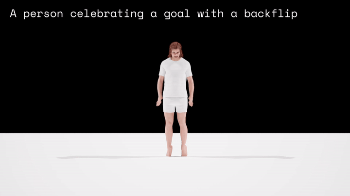
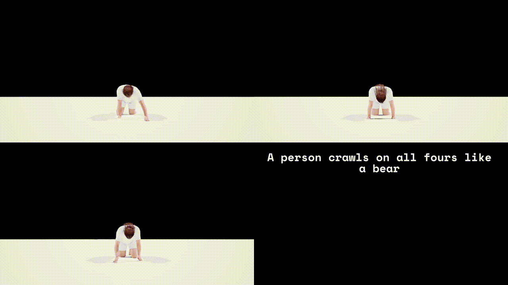
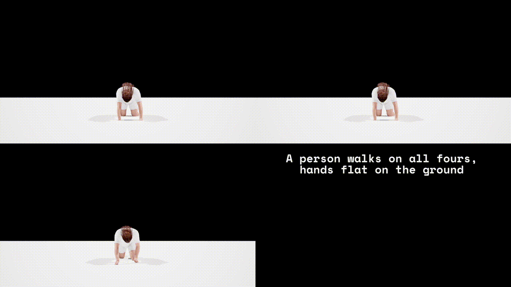
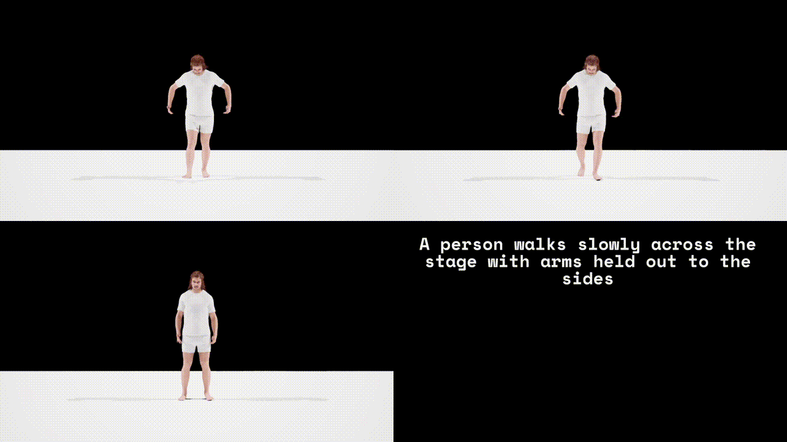
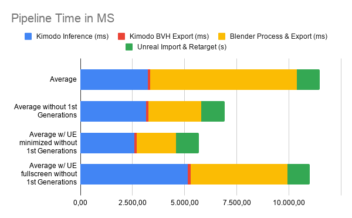
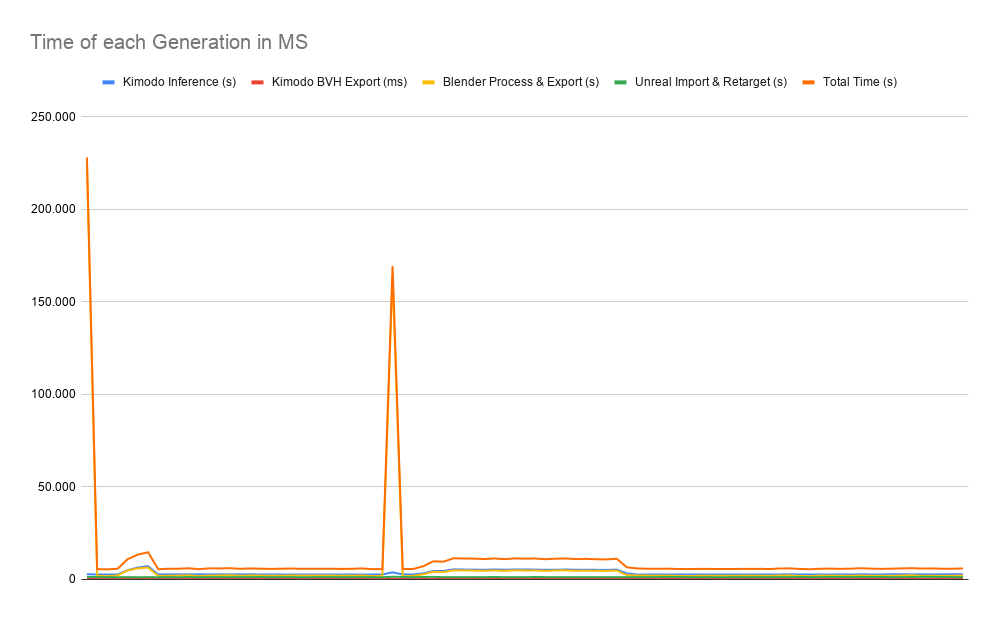
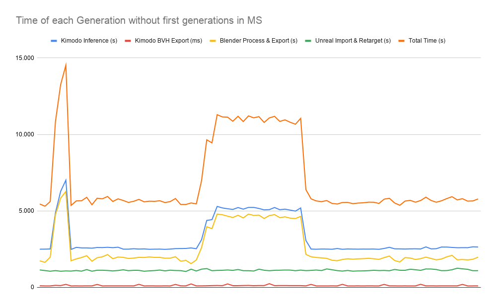

# Avatar Animation

- [Avatar Animation](#avatar-animation)
  - [File Management](#file-management)
  - [Animating an Avatar](#animating-an-avatar)
    - [LiveLink](#livelink)
    - [Pre-Built Animations](#pre-built-animations)
    - [Proceudrally Generating Animations](#proceudrally-generating-animations)
      - [MetaHuman Animator: Audio to Animation](#metahuman-animator-audio-to-animation)
      - [NVIDIA Audio2Face](#nvidia-audio2face)
      - [NVIDIA Kimodo - Full-Rig Diffusion Model](#nvidia-kimodo---full-rig-diffusion-model)
        - [First Test with Kimodo -\> Blender for conversion into FBX animation -\> Retargetting in Unreal Engine to MetaHuman](#first-test-with-kimodo---blender-for-conversion-into-fbx-animation---retargetting-in-unreal-engine-to-metahuman)
        - [Further Kimodo Pipeline Tests](#further-kimodo-pipeline-tests)
          - [Pipeline Time Measurements](#pipeline-time-measurements)
          - [Prompt Engineering](#prompt-engineering)
      - [NVIDIA ACE (Avatar Cloud Engine)](#nvidia-ace-avatar-cloud-engine)
      - [State of the Art: DiDiffGes (2025)](#state-of-the-art-didiffges-2025)
      - [State of the Art: AsynFusion (2025)](#state-of-the-art-asynfusion-2025)

## File Management

**Authors:** Malte Hillebrand

File Change History:

| Date       | Change        | Author |
| ---------- | ------------- | ------ |
| 2026-11-06 | First Version | Malte  |

## Animating an Avatar

### LiveLink

Common interface for streaming and consuming animation data from external sources into Unreal Engine.

A variety of sources can be used to drive a variety of subjects. Some input can move a camera within the engine, a webcam feed can drive a MetaHuman's facial mesh, a MoCap suit can move a MetaHuman's skeleton

### Pre-Built Animations

By pre-building animations and interpolating between them using UE's Blendspace, complex and unique movement can be achieved.

_Problem: Pre-building lots of animations_

### Proceudrally Generating Animations

Generating rig-animations needs to balance generation time and quality.

Complex full-rig animations don't seem to be feasible in real-time yet, while face mesh animation from an audiostream seems to be doable.

#### MetaHuman Animator: Audio to Animation

Native MetaHuman plugin to process audio and build facial animations to be used to move a MetaHuan face mesh.

Works in real-time!

_Lacks a bit of "depth", mostly just mouth movement, not really emotional changes to a face (frowning etc.)_

#### [NVIDIA Audio2Face](https://www.nvidia.com/en-us/omniverse/apps/audio2face.md/)

Is able to generate expressive facial animation from an audio source in real-time

#### [NVIDIA Kimodo](https://research.nvidia.com/labs/sil/projects/kimodo/) - Full-Rig Diffusion Model

Generates a full skeleton animation from a text prompt

- Reasonably fast, but not real-time (~2-5 seconds)
- Does not natively work with UE MetaHuman#s rig (uses SOMA rig, has to be retargeted)

##### First Test with Kimodo -> Blender for conversion into FBX animation -> Retargetting in Unreal Engine to MetaHuman

NVIDIA Kimodo can export as .BVH file, a motion capture file format.

- Generation time for 10 animations in batch:  25.99s
- Average: 2.6 secs
- Time to Load Model:  23.76s
- Device: NVIDIA GeForce RTX 4090

Unreal Engine can NOT natively read .BVH files, but Blender can.

Blender is used to convert the .BVH files into .FBX files with the animation baked in.

To import properly into Unreal Engine a dummy skeleton (cube) is attached to the rig in Blender. This way Unreal Engine recognizes the animation as a skeleton aninmation.

The Kimodo skeleton differs from the UE MetaHuman skeleton. For the re-targeting, each chain of bones in the Kimodo rig has to be named after the chains in the UE MetaHuman rig. Some auto-chaining can be used, but it failed more often than it simplified the process.

BUT: After doing the process ONCE for the Kimodo skeleton, it can be used when importing all other .FBX converted animations WITHOUT MANUAL RE-TARGETING!

The animations are than automatically re-targeted using the existing skeleton and exported as rig animation sequences.

These animation sequences have then to be assigned to the MetaHuman skeleton to be able to drive the MetaHuman mesh.

26/05/13 - Results with little re-targeted bones and therefore buggy behaviour, first tests of the pipeline:

26/05/18 - Results with proper re-targeted bones and (hands and feet need further improvement)

##### Further Kimodo Pipeline Tests

*26/06/09*

“Bear Benchmark” → 10 Prompts x 3 Steps each → 30 Generations

Testing “act like a bear” descriptions to get desired result (avatar on all fours)

Verb Swapping → 10 Prompts x 3 Steps each → 30 Generations

Testing different verbs for scenarios to achieve reliable, expressive animations

Word Order → 9 Prompts x 3 Steps each → 27 Generations

Testing how verb and posture order (in prompt) affects generation

**⇒ 87 generations in total compared (each 9s)**

###### Pipeline Time Measurements

*26/06/09*

- When Unreal Engine is running fullscreen, it starves the background tasks of GPU/CPU cycles, doubling total pipeline latency from ~5.5 seconds to ~11 seconds
  - When background resources are throttled by the OS, Kimodo inference and Blender processing spike symmetrically. ⇒ Unreal Engine needs FPS to be throttled!
- The initial generation spike (~225s) is a of cold-starting the Python and Blender caches
  - Silent, invisible "warm-up" payload helps stabilize the pipeline
- Generation to display architecture is stable, reliably under 6 seconds
⇒ Bypassing Blender via LiveLink Retargeting is essential

###### Prompt Engineering

*26/06/09*

- Verb-Anchoring is Critical: The model needs the action defined immediately. Structuring prompts with the active verb first, followed by the resulting physical posture is  the most reliable syntax.
- "Uncanny Valley" of Detail: The model excels at extremes but fails in the middle. It successfully executes either dead-simple, literal commands or hyper-detailed, cinematic descriptions. Poetic, emotional, or metaphorical middle-grounds confuse the generation.
- Colon-separated, fitness-class style instructions completely break the generation.
- Transition Weakness: The model struggles to process sequential actions (e.g., "bend down, then walk"). If a transition is absolutely necessary, the final, sustained motion must be described with disproportionately high detail to ensure the clip resolves correctly.
- Action-Specific Vocabulary: Simple, universally understood verbs ("collapses", "walks") outperform synonyms with nuanced physical implications ("sinks", "strides") when the surrounding prompt is complex.

#### [NVIDIA ACE](https://developer.nvidia.com/ace-for-games) (Avatar Cloud Engine)

Bit hard for me to fully grasp, but seems to be a complete workflow that does:

1. NLP from voice input
2. Generate LLM output
3. Output TTS and drive facial animations using Audio2Face in real-time
4. Chose and blend between pre-defined animations appropriate to generated answer

#### State of the Art: [DiDiffGes](https://arxiv.org/abs/2503.17059) (2025)

Can generate gestures from speech with just 10 sampling steps.
Decouples gesture data into body and hand distributions

Claims to be real-time!

Demo: https://cyk990422.github.io/DIDiffGes/

! WAS MERGED WITH ANOTHER PAPER ("HoleGest") INTO ["Efficient-Audio-Gesture"](https://github.com/whuhxb/Efficient-Audio-Gesture)

#### State of the Art: [AsynFusion](https://arxiv.org/abs/2505.15058) (2025)

Enables paralell generation of facial and body animation, running a syncrhonization between them to relate their dependencies.

Claims to generate more cohesive / "natural" full body animations from a single audio stream.

Does not seem to work in real-time.