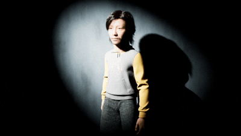
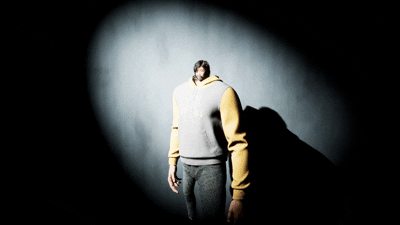
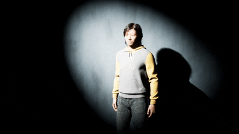
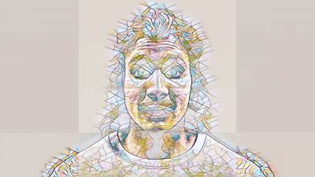

# Avatar Engine

Unreal Engine's [MetaHumans](https://www.metahuman.com/) are used to quickly build, display, animate and distort virtual clones of the Actors.

The integreation deep into the UE systems makes it feasible to render high-quality avatars in real-time using UE's various systems optimized for real-time rendering in virtual production contexts.

## File Management

**Authors:** Malte Hillebrand

File Change History:

| Date       | Change        | Author |
| ---------- | ------------- | ------ |
| 2026-05-04 | First Version | Malte  |

## Building an Avatar

## Animating an Avatar

### LiveLink

Common interface for streaming and consuming animation data from external sources into Unreal Engine.

A variety of sources can be used to drive a variety of subjects. Some input can move a camera within the engine, a webcam feed can drive a MetaHuman's facial mesh, a MoCap suit can move a MetaHuman's skeleton

### Audio to Animation (MetaHuman Animator)

Native MetaHuman plugin to process audio and build facial animations to be used to move a MetaHuan face mesh.

Also works in real-time!

_Lacks a bit of "depth", mostly just mouth movement, not really emotional changes to a face (frowning etc.)_

### Pre-Built Animations

By pre-building animations and interpolating between them using UE's Blendspace, complex and unique movement can be achieved.

_Problem: Pre-building lots of animations_

## Sending Data

Getting data in and out of Unreal Engine

### Transfering Framebuffers

A variety of open-source solutions leverage GPU architecture to send and recieve framebuffers with low-latency.

While Spout and Syphon are the fastest through their OS-specific integration, sharing raw textures directly on the local GPU, NDI offers a cross-plattform solution by encoding video to send over an IP network.

❗ **Raw pixel data** is important for img2img generation using Diffusion models, compression artifacts can alter the diffusion output siginificantly and hinder a visually consistent output.

#### **[Spout](https://spout.zeal.co/) (Windows)**

✅ Transfers raw pixel data

#### **[Syphon](https://syphon.info/) (MacOS)**

✅ Transfers raw pixel data

#### **[NDI](https://ndi.video/): Network Device Interface (Cross-Platform)**

Encodes the video and sends it over an IP network and can also be easily routed locally (using 127.0.0.1 or localhost) to share frames between apps on the same machine.

Integrated into Unreal Engine: NewTek provides an official Unreal Engine plugin.

❌ Sends compressed video frames

Applies a lightweight compression codec. Latency is low (usually around 1 frame), technically slightly heavier on the CPU/GPU than Spout's or Syphon's raw memory sharing.

#### **Native Unreal Alternative: Pixel Streaming**

❌ Sends compressed video frames

It uses a one-way-out architecture to compress and send video frames out of Unreal Engine.

It does not have the capabilities to recieve an image / framebuffer as an input for a shader etc.

### Animation Data

The LiveLink protocol can be used to send data structures from and to Unreal Engine, but it is not designed to parse any arbitrary JSON data. While third-party plugins enable the features, it is computationally heavy! Other, more efficitent data types can be used to improve performance, but still limit actions to animating a skeletal mesh. 

OSC (Open Sound Control) as a protocol can be natively used within Unreal Engine to send and recieve any data, does not have to be sound (!). 
It organizes data using a URL-like address system. Instead of sending a confusing string of numbers, you send a specific value to a specific address.

| Protocol | JSON via LiveLink | OSC (Open Sound Control) |
| --- | --- | --- |
| Performance | Moderate (CPU parsing strings) | Better (Parsing binary data) |
| Ease of Use (Animation) | High. LiveLink maps data directly to skeletal rigs automatically | Low. Have to manually route actions in a(n Animation) Blueprint |
| Flexibility | Limited mostly to transforms and blendshapes | Virtually endless. Can trigger events, change material colors, spawn particles, etc |
| Support | Requires custom third-party plugins | Native UE plugin, supported by almost all creative software |

## Distorting an Avatar

When distorting the avatar, it is important to keep the animation of the TTS and its body language intact and not interfere with this animation layer.

Hence, all distortions appear afterwards and transform later parts of the pipeline.

### Mesh Distortion

The bones' of a MetaHuman can be transformed.

### (Vertex) Shader Distortion

The vertex shader of a MetaHuman can be dsiplaced to transform the mesh.

### Neural Style Transfer

Using Unreal Engine's Neural Post Processing, [ONXX](https://onnx.ai/) Style Transfer of the framebuffer is possible within the Engine.

This is significantly faster than applying a style transfer on the framebuffer: The render pipeline does not need to render a high-quality MetaHuman first, just for it to be processsed again!