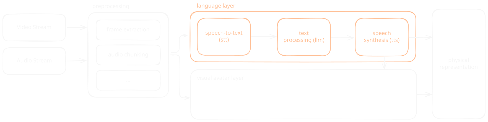

# k.ai

**Authors:** Philip Gerdes, Malte Hillebrand, Lena Gieseke  

File Change History:

| Date       | Change        | Author |
| ---------- | ------------- | ------ |
| 2026-04-22 | First Version | Lena   |

---

* [k.ai](#kai)
        * [File Change History:](#file-change-history)
* [What is k.ai?](#what-is-kai)
    * [Vision \& Goals](#vision--goals)
    * [Usage Scenarios](#usage-scenarios)
        * [Must Haves](#must-haves)
            * [1. Live Rehearsal Improvisation](#1-live-rehearsal-improvisation)
            * [2. Digital Double Capturing](#2-digital-double-capturing)
        * [Optional](#optional)
    * [Avatar Configuration](#avatar-configuration)
        * [Presets and Mappings](#presets-and-mappings)
        * [Temporal Settings](#temporal-settings)
* [System Architecture - 1. Live Rehearsal Improvisation](#system-architecture---1-live-rehearsal-improvisation)
    * [Input / Output](#input--output)
    * [Processing Steps](#processing-steps)
    * [Modularization](#modularization)
        * [Topology](#topology)
    * [Architectural Layers](#architectural-layers)
        * [Orchestration](#orchestration)
        * [Preprocessing](#preprocessing)
            * [Frame Extraction](#frame-extraction)
            * [Audio Chunking](#audio-chunking)
            * [Turn Detection](#turn-detection)
            * [Additional Sensing](#additional-sensing)
        * [STT](#stt)
        * [Motion Estimation](#motion-estimation)
        * [LLM](#llm)
        * [TTS](#tts)
        * [Avatar Engine](#avatar-engine)
            * [Distortions](#distortions)
        * [Control \& Configuration](#control--configuration)
            * [GUI](#gui)
            * [Input Files](#input-files)
            * [Avatar Configuration and Prompt Library](#avatar-configuration-and-prompt-library)
        * [Scene Recording](#scene-recording)
* [System Architecture - 2. Digital Double Capturing](#system-architecture---2-digital-double-capturing)
* [Open Questions](#open-questions)
* [Risks](#risks)
* [Work In Progress Tracking](#work-in-progress-tracking)
    * [Active Tasks](#active-tasks)
    * [Backlog](#backlog)
    * [Done](#done)
* [Glossary](#glossary)
* [References \& Links](#references--links)

# What is k.ai?

K.ai is a real-time generative AI system built for theatrical rehearsal and improvisation. It serves as an interactive, non-human scene partner for actors in an improvisation scenario. The system perceives audio and video from the rehearsal room, processes these signals through a multimodal pipeline, and responds with synthesized speech and a moving visual avatar, displayed, e.g., on a screen or being projected. The avatar is not a simulated actor but a deliberately distorted entity and its errors and non-human deviations are the artistic material, not defects to be corrected. The avatar's specific behavior, and appearance can be shaped and mutated by the humans during rehearsal.

The K.ai system is developed in the context the artistic-scientific research project [Kaspar 2028 - AI as a Theatrical Toolbox](https://www.kulturstiftung-des-bundes.de/en/programmes_projects/image_and_space/detail/kaspar_2028.html), funded by the German Federal Cultural Foundation in the [Art & AI](https://www.kulturstiftung-des-bundes.de/en/programmes_projects/film_and_new_media/detail/kunst_und_ki.html). Hand in hand with the experimentation with K.ai, we are going to produce a repertoire-ready stage production of Peter Handke's *Kaspar* at the Residenztheater in Munich, in May 2028.

## Vision & Goals

The K.ai system should include the following features:

* Live improvisation between a human performer and an algorithmic, virtual avatar in the rehearsal room
* Experimentation with the progressiv distortion of the avatar into something alien and unstable
* A pipeline that creates a digital double of a performer, to a degree recognizable in appearance and voice, to be used as avatar basis
* Production of recordings of the avatar's performance for re-use
* Operability without engineering competences
* A modular and extensible setup, easy to update to the newest developments
* Open source release for use by creatives

K.ai is explicitly NOT:  
* A general-purpose AI-system trained on human performance
* A simulated actor substituting a human performer
* A chatbot-style dramaturgy assistant
* A tool for script analysis, play interpretation, or general Q&A
* A system aiming for human-likeness — the goal is productive distortion, not realism
* A replacement for human creative development

## Usage Scenarios

*Who does what, when, under what conditions?*

### Must Haves

#### 1. Live Rehearsal Improvisation

* One performer enters a defined rehearsal space. The algorithmic avatar, is active. The performer speaks and moves and the system processes the audio and video stream through its pipeline, and responds, interrupts, acts up, etc. in real time.  
* Human creatives can pre-configure the avatar's personality, behavioral rules, or mutation parameters or adjust them on the fly via an interface. 
* Scenes are recorded (*Open question*: What is exactly recorded?).

#### 2. Digital Double Capturing

* A human performer can be digitized via a lightweight capture pipeline, ideally built from off the shelf hardware (e.g. consumer cameras, smartphones).
* The resulting digital double can be used as an avatar within K.ai with all functionality.
* *Open question*: What likeness is required? 

### Optional

Scripted performances  
* A scene is pre-scripted and can be loaded in K.ai to be performed by the avatar and actor.
  
Performance VJing  
* In addition to the performance of the avatar, there are some VJing options for humans to use during the performance, such as sequencing (the temporal arrangement of audiovisual clips or effects) to further modulate the generated audiovisual content.

## Avatar Configuration

### Presets and Mappings

Input-output relations
* Mappings from sensor signals to output behavior and stylization. 
* Example: "the less the scene partner says, the more destroyed the avatar becomes". 
* These relations are pre-defined by the creative team.

Behavior bundles
* Predefined sets of behaviors (personality, mood, movement style, vocal character, etc.) that can be selected, switched and modified at runtime. 
* Examples: animalistic movement patterns

### Temporal Settings
* Response delays as expressive parameter
* Mutation trajectories, e.g., progressive divergence from 1:1 mirroring toward distortion

# System Architecture - 1. Live Rehearsal Improvisation 

## Input / Output 

Input triggers are understood as both 
* *direct input* (explicit speech directed at the avatar) and 
* *indirect input* (co-presence as, e.g., movement, proximity, posture).

| Input                                   | Description                               |
| --------------------------------------- | ----------------------------------------- |
| Audio stream                            | Microphone                                |
| Video stream                            | Camera feed                               |
| Text Prompts, Controller (slider, etc.) | Custom made GUI                           |
| Configuration File(s)                   | *Open question*: TOML, JSONC, plain text? |
| Stored scenes                           | Previously recorded K.ai outputs          |

| Output                                  | Format            | Destination                                    |
| --------------------------------------- | ----------------- | ---------------------------------------------- |
| Voice                                   | Audio stream      | Speakers in rehearsal room or theatre          |
| *Open question*: Ambient sound / music? | Audio stream      | Speakers in rehearsal room or theatre          |
| Visual avatar                           | Video             | Display / Projection / LED wall                |
| Scene recordings                        | File (format TBD) | Archive for re-use on stage or as future input |

## Processing Steps

*To Do*: Fill in avatar layer

| Step                              | Description                                                                                                                                          |
| --------------------------------- | ---------------------------------------------------------------------------------------------------------------------------------------------------- |
| Preprocessing                     | Frame extraction from video, audio chunking                                                                                                          |
| STT   Speech to Text          | Transcription of microphone input                                                                                                                    |
| Pose & Motion Estimation          | Extracts skeletal data, proximity, and posture from video to drive indirect input                                                                    |
| LLM     Large Language Model | Text processing and response generation, conditioned on behavior parameters from GUI and configuration                                               |
| TTS   Text to Speech         | Voice synthesis for the avatar                                                                                                                       |
| Avatar Rendering                  | Composites the visual avatar from driving signals: raw or distorted video, pose data, LLM behavior tags, parameters from GUI, text prompt and config |
| Scene Recording & Loading         | Captures session output to archive, or loads stored scenes as input                                                                                  |

## Modularization

*To Do:* Update figure.

### Topology

Two possible topologies:

| Mechanism                                                                                                                                                                                   | Benefits                                                                                                          | Tradeoff                                                                                                                                 |
| ------------------------------------------------------------------------------------------------------------------------------------------------------------------------------------------- | ----------------------------------------------------------------------------------------------------------------- | ---------------------------------------------------------------------------------------------------------------------------------------- |
| Single workstation with multiple dedicated GPUs, data exchange via CUDA IPC or shared memory                                                                                                | <ul><li>Lowest latency</li></ul>                                                                                  | <ul><li>Highest cost and complexity</li><li>Most likely not feasible with the available resources (competencies, budget, etc.)</li></ul> |
| Each segment as an independent server with OpenAI API compatible endpoint (the OpenAI schema as de facto standard for LLM, STT, and TTS services), IPC over local network (e.g. WebSockets) | <ul><li>Highest flexibility</li><li>Works with existing hardware</li><li>Allows fallback to hosted APIs</li></ul> | <ul><li>Network adds latency </li></ul>                                                                                                  |

Chosen Approach (22.04.2026): Each processing segment runs as an independent server.

## Architectural Layers

| Layer                   | Tech                                                                              | Notes                                                                                                                           |
| ----------------------- | --------------------------------------------------------------------------------- | ------------------------------------------------------------------------------------------------------------------------------- |
| Hardware                | Multiple workstations with dedicated GPUs                                         | One per segment, distributed via local network                                                                                  |
| OS                      | *TBD:* Linux for inference segments, Windows for the Avatar engine and distortion | Windows constraint comes from the Spout dependency                                                                              |
| Orchestration           | LiveKit Agents                                                                    | Pipeline management across all processing steps                                                                                 |
| Preprocessing           | *TBD*                                                                             | Frame extraction, audio chunking, turn detection, additional sensing signals                                                    |
| STT                     | *TBD*                                                                             | Candidates: Whisper, faster-whisper, Gemma 4 native audio                                                                       |
| Motion Estimation       | *TBD*                                                                             | Drives indirect input from camera feed                                                                                          |
| LLM                     | *TBD*                                                                             | Preference: local inference, OpenAI compatible endpoint, permissive license                                                     |
| TTS                     | *TBD*                                                                             | Candidates: Fish Audio S2 Pro (license TBD), others                                                                             |
| Avatar Engine           | Unreal Engine + MetaHuman, Vertex shaders, bone manipulation, ComfyUI             | LiveLink, FaceBuilder?   Spout is Windows only, pinning this segment to a Windows node [^1]                                |
| Control & Configuration | *TBD*                                                                             | <ul><li>GUI controls</li><li>Configuration files</li><li>Avatar configuration and prompt library</li><li>Saved scenes</li></ul> |
| Scene Recording         | *TBD*                                                                             | Format and storage layer for stored scenes referenced below                                                                     |

[^1]: Integration: capturing the Spout output in an external application (OBS, a Python script using spoutGL, etc.) and have that application publish to LiveKit, since no first party LiveKit Unreal plugin exists.

### Orchestration

Coordination across segments is handled by [LiveKit Agents](https://github.com/livekit/agents), an open source Python and Node.js framework for stateful, multimodal AI agents that join WebRTC rooms as participants and orchestrate STT, LLM, TTS, and vision plugins for realtime voice and video interaction.  

WebRTC (Web Real Time Communication) is a low latency protocol use by LiveKit for realtime audio, video, and data streams, to handle transport and synchronization between distributed processing segments. Each segment joins a shared session ("room") as a participant, which removes the need for a custom sync layer between microphone input, avatar video, and synthesized voice.

[Further Information ➚](./layer/kai_layer_hardware_os_orchestration.md)

| Decision | Options Considered | Chosen Approach | Reasoning | Date |
| -------- | ------------------ | --------------- | --------- | ---- |
|          |                    |                 |           |      |

### Preprocessing

#### Frame Extraction  
* From the video stream, fan out to downstream consumers (pose estimation, avatar compositing, optional vision capable LLM input). 
* Frame rate and resolution per consumer should be set independently to avoid overfetching.

#### Audio Chunking  
* For STT input, driven by Voice Activity Detection (VAD) rather than fixed time windows. 
* [Silero VAD](https://github.com/snakers4/silero-vad) is the de facto open source standard and is natively integrated into `faster-whisper`. Tunable parameters: activation threshold, silence duration, prefix padding.

#### Turn Detection  
* The related but distinct decision of *when the user has finished speaking* and the avatar should respond. 
* Three common strategies
    * VAD timeout (simple, prone to interrupting pauses)
    * Semantic VAD (LLM judges utterance completeness, higher latency)
    * Dedicated turn detection models (e.g. LiveKit's transformer based detector)
* For k.ai we also want to deliberately *mis*judge turn boundaries (interrupting, pausing too long, responding to half utterances).

#### Additional Sensing

* Additional sensing signals for co-presence input (skeletal pose, proximity, gaze, gesture). These feed the Motion Estimation step rather than STT, but share the preprocessing concern of synchronization with audio and video frames so downstream stages see a temporally coherent snapshot.

[Further Information ➚](./layer/kai_layer_preprocessing.md)

| Decision | Options Considered | Chosen Approach | Reasoning | Date |
| -------- | ------------------ | --------------- | --------- | ---- |
|          |                    |                 |           |      |

### STT

TODO

[Further Information ➚](./layer/kai_layer_stt.md)

| Decision | Options Considered | Chosen Approach | Reasoning | Date |
| -------- | ------------------ | --------------- | --------- | ---- |
|          |                    |                 |           |      |

### Motion Estimation

TODO

[Further Information ➚](./layer/kai_layer_motion_esitmation.md)

| Decision | Options Considered | Chosen Approach | Reasoning | Date |
| -------- | ------------------ | --------------- | --------- | ---- |
|          |                    |                 |           |      |

### LLM 

TODO

[Further Information ➚](./layer/kai_layer_llm.md)

| Decision | Options Considered | Chosen Approach | Reasoning | Date |
| -------- | ------------------ | --------------- | --------- | ---- |
|          |                    |                 |           |      |

### TTS  

TODO

[Further Information ➚](./layer/kai_layer_tts.md)

| Decision | Options Considered | Chosen Approach | Reasoning | Date |
| -------- | ------------------ | --------------- | --------- | ---- |
|          |                    |                 |           |      |

### Avatar Engine

TODO

Base architecture: [MetaHuman](https://www.metahuman.com) in [Unreal Engine](https://www.unrealengine.com/)

Input:
* Motion capture (TODO: how specifically?) via [LiveLink](https://dev.epicgames.com/documentation/unreal-engine/live-link-in-unreal-engine) in Unreal Engine
* Face mesh via [FaceBuilder](https://keentools.io/products/facebuilder-for-blender) (paid) (TODO: does what exactly?)

#### Distortions

TODO

Distortion layer (applied after animation):  
1. Bone transform manipulation of the rig
2. Scrambled LiveLink association (e.g. left eye controls right arm)
3. Vertex shader deformations

* [Spout](https://spout.zeal.co/) for GPU video buffer sharing between Windows applications
* ComfyUI Spout Nodes enable real-time Stable Diffusion generation on the UE output image

[Further Information ➚](./layer/kai_layer_avatar_engine.md)

| Decision | Options Considered | Chosen Approach | Reasoning | Date |
| -------- | ------------------ | --------------- | --------- | ---- |
|          |                    |                 |           |      |

### Control & Configuration

TODO

#### GUI

#### Input Files

#### Avatar Configuration and Prompt Library

### Scene Recording

[Further Information ➚](./layer/kai_layer_scene_recording_file_management.md)

---
---

# System Architecture - 2. Digital Double Capturing

TODO

---
---

# Open Questions

| Question                                                | Context                                                                                                                                  | Owner | Status |
| ------------------------------------------------------- | ---------------------------------------------------------------------------------------------------------------------------------------- | ----- | ------ |
| Fish Audio S2 Pro license                               | Currently "research use only", does that apply to us?                                                                                    | Lena  | WIP    |
| How to define indirect / co-presence input technically? | What signals, at what granularity, map to what behaviors?                                                                                |       | Open   |
| Ethical AI                                              | Compatible with latency and multimodal requirements?                                                                                     |       | Open   |
| Configuration file format                               | TOML, YAML, JSONC, or plain text? Affects prompt library, session config, and scene recall files. Tradeoff between footguns and tooling. |       | Open   |
| Scene recording format and storage                      | What gets archived (video, audio, parameter snapshots, transcripts, all of the above)? Where and in what format?                         |       | Open   |
| Latency budget per pipeline segment                     | Targets currently TBD across all segments. Required to validate the distributed topology against realtime constraints.                   |       | Open   |
| Ambient sound and music output                          | Separate audio stream, mixed with voice, or out of scope?                                                                                |       | Open   |
| How to support a "co-presence"?                         | E.g., with a spatial audio setup                                                                                                         |       | Open   |
| Which terminology to use?                               | Is K.ai the whole system (as used in this document) or the avatar? Do we want to deal with anthropomorphizing language?                  |       | Open   |

# Risks

| Risk                                                       | Likelihood | Impact | Mitigation                                                                      |
| ---------------------------------------------------------- | ---------- | ------ | ------------------------------------------------------------------------------- |
| Latency too high for live improvisation                    | High       | High   | Local inference; GPU-per-module; minimize network hops; fallback to hosted APIs |
| LLM output too coherent and "normal"                       | Medium     | High   | Think about "breaking" the system?                                              |
| Team unfamiliarity with Linux                              | Medium     | Medium | Evaluate WSL/Docker; Windows as fallback with performance trade-off             |
| Hardware insufficient for real-time multi-segment pipeline | Medium     | Medium | Profile early; design fallback to hosted APIs; New hardware purchases           |

---
---

# Work In Progress Tracking

## Active Tasks

* Initial architecture validation: STT → LLM → TTS pipeline with LiveKit Agents
* LLM module: Gemma 4 local inference setup (vLLM / ollama)
* Avatar layer: MetaHuman rig + LiveLink + distortion prototype

## Backlog
*Features and tasks queued but not yet started.*

| Item | Priority | Owner | Notes |
| ---- | -------- | ----- | ----- |
|      |          |       |       |

## Done
*Completed items worth recording for context.*

---
---

# Glossary
*Domain-specific or project-specific terms defined for external readers.*

| Term               | Definition                                                                                                                                                                                            |
| ------------------ | ----------------------------------------------------------------------------------------------------------------------------------------------------------------------------------------------------- |
| K.ai / Kaspar.ai   | The AI system developed for Kaspar 2028                                                                                                                                                               |
| STT                | Speech-to-text: converts spoken audio to text                                                                                                                                                         |
| LLM                | Large language model: generates text responses                                                                                                                                                        |
| TTS                | Text-to-speech: synthesizes spoken audio from text                                                                                                                                                    |
| RAG                | Retrieval-Augmented Generation: extends LLM context with retrieved documents                                                                                                                          |
| MetaHuman          | Unreal Engine tool for creating high-fidelity digital humans                                                                                                                                          |
| LiveLink           | Unreal Engine protocol for streaming real-time animation data                                                                                                                                         |
| Spout              | Windows framework for sharing GPU video buffers between applications                                                                                                                                  |
| Virtual Production | Real-time CGI techniques for filmmaking                                                                                                                                                               |
| Co-presence        | The felt sense of sharing a space with another agent, sustained by mutual awareness and continuous low level signaling (gaze, posture, proximity, breath, etc.) rather than by explicit interactions. |
| Brain damage       | Working metaphor for the system: deliberately broken or scrambled to produce alien, non-human behavior                                                                                                |

---

# References & Links

TODO
