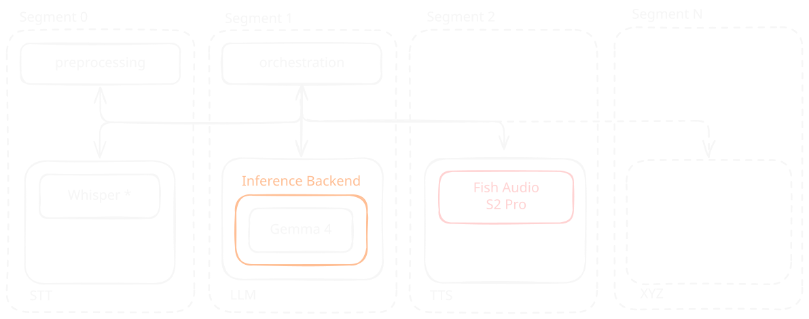

Kaspar 2028 
Supervised by Prof. Dr. Lena Gieseke

# K.ai: Entwurf Architektur

Initialer Umriss

  
übersicht

  
modularisierung

  
orchestrierung

  
sst

  
llm

  
tts

---
<!-- 
header: 'Kaspar 2028 / K.ai: Entwurf Architektur'
-->

# Kernfunktionalität

- Latenz minimieren (Echtzeit-Pipeline)
- Multimodale Signalverarbeitung (Sehen & Hören)

  
übersicht

  
modularisierung

  
orchestrierung

  
sst

  
llm

  
tts

---

# Modularisierung

  
übersicht

  
modularisierung

  
orchestrierung

  
sst

  
llm

  
tts

---

- Kürzeste Latenz
  - 1 spezialisierte Workstation mit mehreren dedizierten GPUs für versch. Module
  - Datenaustausch durch CUDA IPC (GPU-to-GPU) oder Shared Memory
  - Höchste Kosten & höchste Komplexität (nicht umsetzbar)
- Größte Flexibilität
  - Jedes Segment als Server mit `openai api` kompatiblem Endpunkt
  - IPC über lokales Netzwerk (zB.: Websockets)
  - gutes Mapping auf vorhandene Hardware (Verteilung auf mehrere Workstations)
  - nahtloses Fallback auf gehostete APIs (zB.: OpenAI Realtime API)

  
übersicht

  
modularisierung

  
orchestrierung

  
sst

  
llm

  
tts

---

# Orchestrierung

> [LiveKit Agents](https://github.com/livekit/agents)

- spezifisch entwickelt für STT → LMM → TTS Pipelines
- nahtlose Kompatibilität mit `openai api`

  
übersicht

  
modularisierung

  
orchestrierung

  
sst

  
llm

  
tts

---

# STT Modul

> [Whisper](https://openai.com/de-DE/index/whisper/)

- [`faster-whisper`](https://github.com/SYSTRAN/faster-whisper)
- [`whisper-flow`](https://github.com/dimastatz/whisper-flow)
- Möglicherweise obsolet wenn Gemma 4 Audio Input genutzt werden kann

  
übersicht

  
modularisierung

  
orchestrierung

  
sst

  
llm

  
tts

---

# LLM Modul

> [Gemma 4](https://huggingface.co/collections/google/gemma-4)

- Multimodaler Input direkt in das LLM
- Spezifische Optimierungen für lokale Inferenz
  - [TurboQuant](https://research.google/blog/turboquant-redefining-ai-efficiency-with-extreme-compression/)
  - [Per-Layer Embeddings](https://newsletter.maartengrootendorst.com/i/193064129/per-layer-embeddings)
- Apache 2.0 Lizenz
- Verfügbar in `vLLM` und `ollama (llama.cpp)`

  
übersicht

  
modularisierung

  
orchestrierung

  
sst

  
llm

  
tts

---
Linux ?

- Deutlich besserer Support für Inferenz-Provider (`SGLang` & `vLLM`)
- Mangelnde Erfahrung mit WSL oder Docker bzw. Linux allgemein (Philip)

  
übersicht

  
modularisierung

  
orchestrierung

  
sst

  
llm

  
tts

---

# TTS Modul

> [Fish Audio S2](https://github.com/fishaudio/fish-speech)

- Unklare Lizenzierung (Nur zu Forschungszwecken) ! https://github.com/fishaudio/fish-speech/blob/main/LICENSE

  
übersicht

  
modularisierung

  
orchestrierung

  
sst

  
llm

  
tts

  