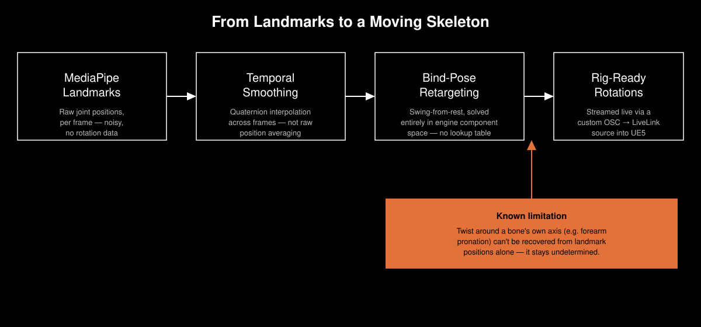
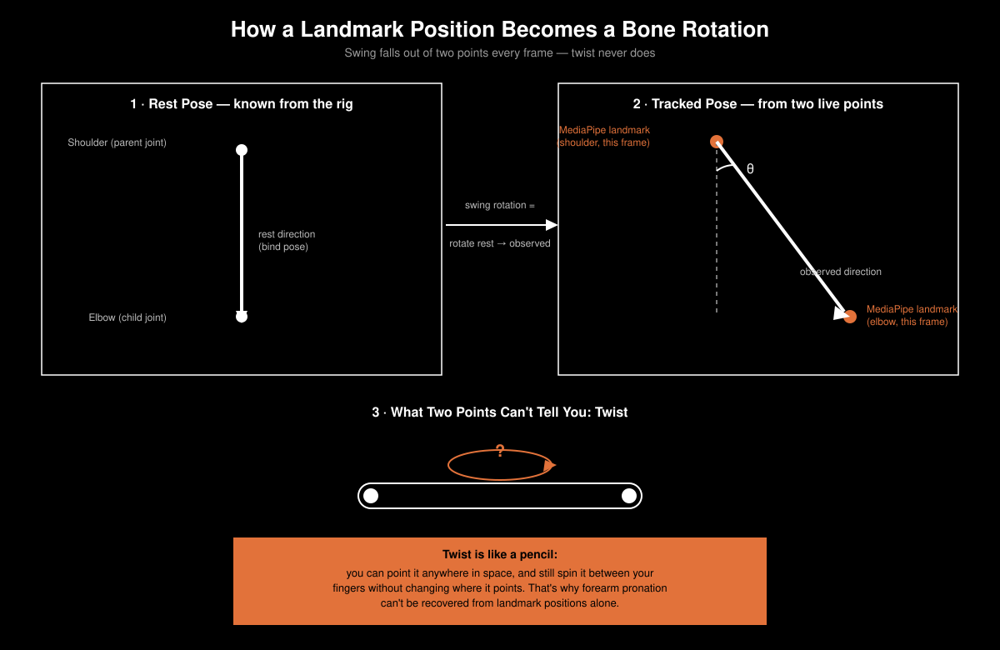

# The Open-Source Blind Spot in Realtime Motion Capture

Somewhere in a black-box theatre, a performer moves, and half a second later a MetaHuman mirrors them on a screen ten meters away — no suit, no markers, just a webcam. That's one of the core mechanics behind *KASPAR*, our live performance pipeline built around AI-generated digital humans, where real-time motion capture, neural rendering, and theatrical performance all have to work together on stage, live, with no room for a crash.

Getting a MetaHuman to move convincingly off nothing but a camera feed in realtime turned out to need a piece of software that, as far as we could establish, simply didn't exist yet in the open. Unreal Engine 5.8 ships with a new feature, decievingly called "Markerless Motion Capture", which crushed our hopes after switching to the new version: The motion capture works in pre-calculated batches — perfect for low-budget productions without a MoCap studio, unusable for our case when realtime mirroring is needed. 

## The gap we found

Before writing a line of our own code, we mapped what already exists for realtime markerless motion tracking — split by whether it's open source or not.

| | Closed Source, Proprietary | Open Source |
|---|---|---|
| **Facial Tracking** | MediaPipe4U | MeFaMo, Epic's LiveLink Face *(iOS only)* |
| **Full-Body Tracking** | MediaPipe4U, DollarsMoCap | — |

The pattern is stark. For *facial* tracking, realtime open-source options genuinely exist. For *full-body* tracking, that same cell is empty. Everything realtime and usable for full-body markerless capture is closed-source and proprietary. If you want to drive a full skeleton live and you're not willing to pay for and depend on a vendor's black box, there's nothing to reach for.

That's not a minor inconvenience. It's a structural blind spot in the tooling every technical artist and creative technologist working with realtime avatars eventually runs into. Once we saw it laid out this plainly, "build it ourselves" stopped being the ambitious option and started being the only one that made sense to also give back to everyone else stuck in that same empty cell.

## Why MediaPipe

MediaPipe, Google's computer vision framework, is the obvious foundation: Fast enough to run live, well documented, and free. But it ships as three separate trackers and picking between them isn't obvious.

**Pose** gives you a full-body skeleton and is fast and stable, but it's body-only.

**Face Mesh** runs separately and gives a dense, 468-point facial landmark mesh: Plenty for detailed expression capture, but it's its own model with its own tracking loop, not something Pose picks up for free.

**Holistic** tries to fuse face, pose, and both hands into one unified output, which sounds like the answer until you actually run it: fusing three separate models costs latency and robustness, and it shows first in the extremities — hands lag, cross-contaminate with pose estimates, or simply drop out under fast motion.

The deeper limitation applies to all of them equally: every MediaPipe tracker hands you *landmark positions* — points in space — never bone rotations. For a webcam that's the right output. For driving a skeletal rig, it's the start of the actual problem, not the end of it.

## From landmarks to a moving skeleton
 
Turning `world_landmarks`, a cloud of noisy 3D points, into stable, correctly-rotated bones on a rig is where most of the real engineering sits, and it happens in two distinct steps.
 
First, temporal smoothing. Landmark positions jitter frame to frame — a smoothing filter has to work on rotations, not positions, to actually be usable, which means it operates in quaternion space rather than as naive averaging.
 
Second, retargeting: mapping those smoothed positions onto a specific character's bind pose. This is the part that has no clean off-the-shelf answer. It has to be solved as *swing from rest* (how far has each bone swung away from its resting orientation) computed directly in the engine's own component space, rather than through a static lookup table built against some reference pose. A lookup table is exactly the kind of shortcut that looks fine in a demo and then falls apart the moment a performer's proportions or starting stance don't match what was hardcoded.
 

 
Zooming in on a single bone makes that retargeting step concrete. Two tracked points, a parent joint and a child joint, give us a direction in space. That direction alone is enough to solve for *swing*, the rotation that points the bone the right way. It is never enough to solve for *twist*, the rotation around the bone's own length, for the same reason you can point a pencil anywhere in a room and still spin it between your fingers without changing where it's aimed.
 

 
## Getting it into the engine: why OSC
 
Once we have rotations, we need to get them into the game engine every single frame without adding a network stack's worth of overhead. OSC (Open Sound Control) is a good fit for exactly this: it's a lightweight, UDP-based protocol with a flexible, self-describing message schema, built originally for realtime musical control data, in other words, built for the same latency and jitter tolerances a live motion feed needs.
 
The other deliberate choice was writing a dedicated native LiveLink source in the engine rather than routing incoming data through Blueprint-level plumbing. Blueprint is fine for prototyping, but at sixty frames a second, on a stage, every layer of indirection is a place for a frame to drop. A native source that does nothing but move data from the network straight into the animation system is slower to build and much harder to break.
 
## The honest limitation
 
Not everything is solvable from landmark positions alone, and it's worth saying plainly rather than glossing over: twist around a bone's own axis — forearm pronation is the clearest example — simply isn't observable from where a joint sits in space. You can see an elbow bend; you can't see a forearm rotate around itself from position data. It stays genuinely undetermined.
 
## When bugs became a feature
 
After showing an early version to the rest of the team, something unexpected happened: the artifacts — a head that wouldn't quite rotate right, fingers that twisted in ways no human hand does — didn't read as broken. They read as *expressive*. In a project already built around AI-generated performers, a little uncanny distortion fit the aesthetic rather than undermining it.
 
That reaction reshaped the actual design goal. Rather than leaving the twist ambiguity and other quirks as accidental texture, the plan is to build the core tracker to be as clean and correct as possible and then add distortion as its own separate, deliberately controllable layer on top. Artifacts as a creative choice, not a bug tolerated because nobody got around to fixing it.
 
## Why we're open-sourcing it
 
None of this is exotic engineering — smoothing, retargeting, and a network protocol are all well-understood problems individually. What's missing is someone having put them together into a realtime, full-body, open-source package and published it. That's the empty cell in the table above and why we're happy to release out markerless motion tracking tool for Unreal Engine.
 
If you're a creative technologist or programmer who has hit that same wall, needing live full-body tracking without buying into a closed vendor stack, the goal is for it to be the thing that was missing when we went looking. We're aiming to have a working version finished by the end of the year.