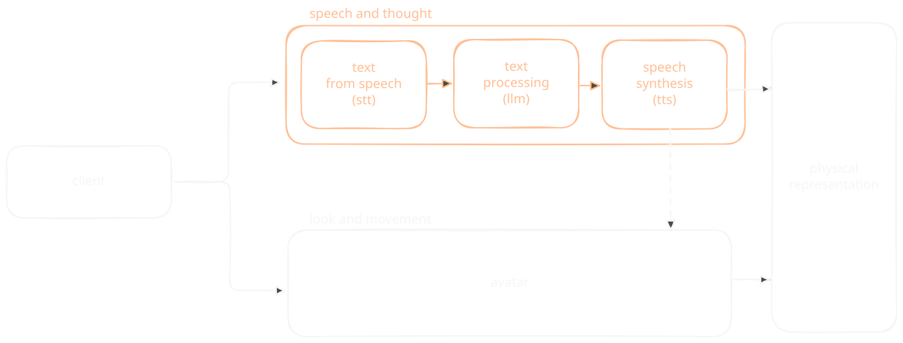
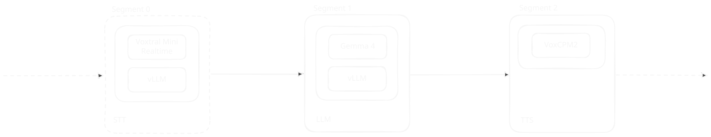
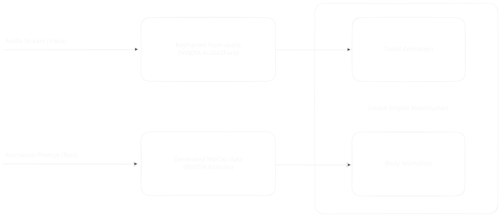
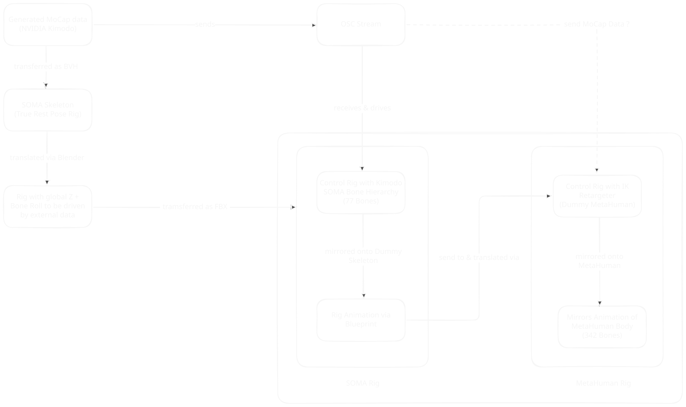
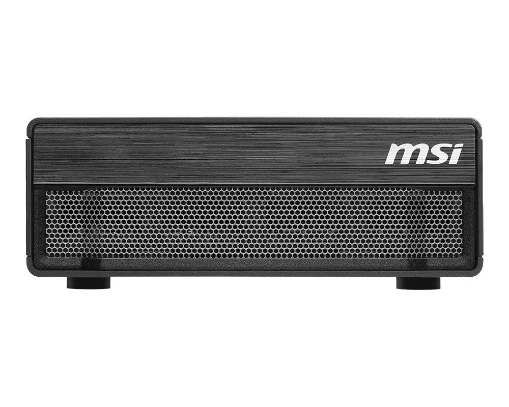

Kaspar 2028 / Development K.ai 
Supervised by Prof. Dr. Lena Gieseke

# Teamtreffen: Überblick K.ai

Juli 2026

<audio controls src="./resourcen/intro-ilja.wav"></audio>

  
speech and thought

  
look and movement

---

<!-- 
header: 'Teamtreffen Juli 2026'
-->

## Architektur

  
speech and thought

  
look and movement

---

## Modularisierung

- [`mistralai/Voxtral-Mini-4B-Realtime-2602`](https://huggingface.co/mistralai/Voxtral-Mini-4B-Realtime-2602) (Apache-2.0)
- [`google/gemma-4-E4B-it`](https://huggingface.co/google/gemma-4-E4B-it) (Apache-2.0)
- [`openbmb/VoxCPM2`](https://huggingface.co/openbmb/VoxCPM2) (Apache-2.0)

  
speech and thought

  
look and movement

---

## Demos

- `MM Feed`
- `Voice Cloning`

  
speech and thought

  
look and movement

---

  
speech and thought

  
look and movement

---

  
speech and thought

  
look and movement

---

## Demos

- `Prompting Demo`
- `Distortions`

  
speech and thought

  
look and movement

---

## Ausblick

  
speech and thought

  
look and movement

